# Introduction to BEAST

## Introduction
This practical will introduce the BEAST software for Bayesian evolutionary analysis. This exercise will demonstrate how to use BEAST to estimate the rate of evolution of an influenza virus data set that has been sampled from multiple time points.

To undertake this practical, you will need to have access to the following software packages (available from [tree.bio.ed.ac.uk](http://tree.bio.ed.ac.uk/software/)) in a format that is compatible with your computer system (all three are available for Mac OS X, Windows and Linux/UNIX operating systems):

* **BEAST** - this package contains the BEAST program, BEAUti, TreeAnnotator and other utility programs. At the time of writing, the current version is v1.8.2.
* **Tracer** - this program is used to explore the output of BEAST (and other Bayesian MCMC programs). It graphically and quantitively summarizes the distributions of continuous parameters and provides diagnostic information. At the time of writing, the current version is v1.6.
* **FigTree** - this is an application for displaying and printing molecular phylogenies, in particular those obtained using BEAST. At the time of writing, the current version is v1.1.

The workflow is as follow:

1. Create an XML file using **BEAUTi** containing your data set and other information (i.e. model, MCMC settings). This file will be the input file of **BEAST**.
2. Run **BEAST** on the XML file.
3. Check that the output of **BEAST** using Tracer.
4. Generate maximum credibility tree with annotations using **TreeAnnotator**.
5. Visualize annotated tree using **FigTree**.

## Alignment file
We are going to analyse the haemagglutinin gene of 21 influenza A viruses (subtype H1N1) sampled between 1997 and 2005. The sampling date, in years, is included at the end of each sequence name. The alignment length is 1698 bp.

## BEAUti
The program BEAUti is a user-friendly program for setting the model parameters for BEAST. 

Run **BEAUTi**:
* Linux: Open the command line and type `beauti`. If the program is not in the path type the full path to the program (e.g. `/home/user/BEAST/bin/beauti` where `BEAST` is the BEAST distribution folder).
* Mac: Double click the `BEAUTi.app` in the `Applications` folder.
* Windows: Double click the `BEAUTi.exe`.

### Loading sequences:

Load the `Flu.nex` file located in `examples/VirusPractical/Flu/` inside the BEAST  distribution folder by selecting the **File** menu and then **Import Data...**:
[//]: # (Load `Flu.nex` file available in the `/mnt/gvl/apps/linuxbrew/opt/beast/examples/VirusPractical/Flu/` directory by selecting the **File** menu and then **Import Data**:)

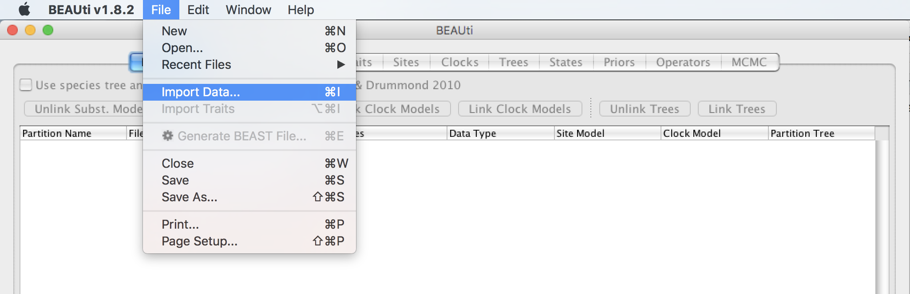

Once the alignment is loaded, it is listed under the **Partitions** tab together with information about the alignment:

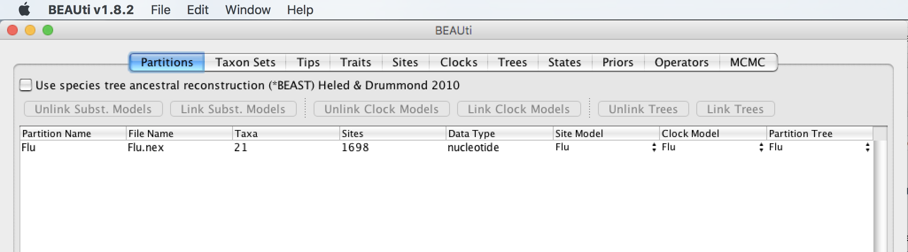

### Extracting sampling dates from sequence names:
By default the sampling date of each sequence is equal to 0. In order to use the dates provided in the NEXUS file click on the **Tips** tab and select **Use tip dates**. Click on the **Guess Dates** button and select the options as shown in the figure below:

### Setting up substitution model

Select the **Sites** tab and choose your favorite substitution model. For this tutorial we will select the HKY substitution model and the gamma distribution to account for rate heterogeneity across sites. Base frequencies will be estimated and the gamma distribution will be discretized into 4 categories. It is important to note that this model might not be the best model but this model is simple and it requires less computation than a complex model.

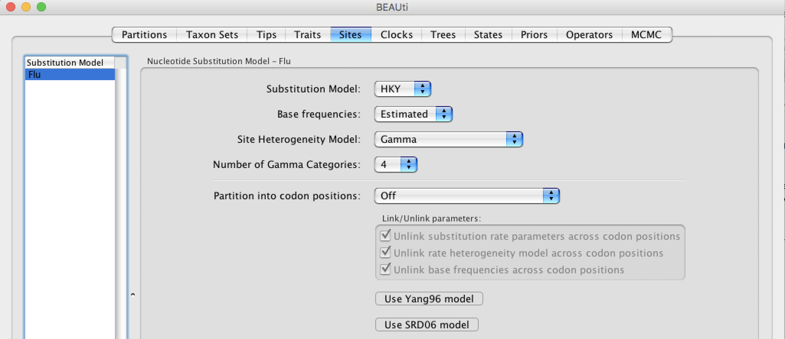

### Setting up the clock
Select the **Clocks** tab and choose from 5  types of clocks. The *strict clock* is the simplest model and it will force every lineage to evolve at the same rate while the other models will relax this assumption in different ways. We will choose the *Lognormal relaxed clock (Uncorrelated)* option. This model implies that the substitution rate among lineages is heterogeneous and that the rate for each lineage is draw independently and identically from a log-normal distribution.

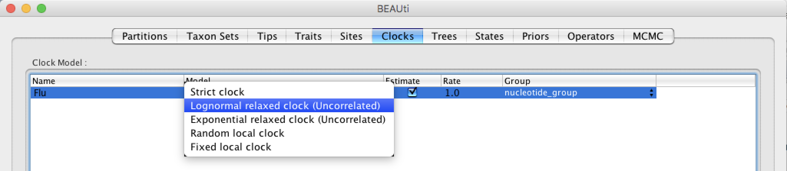

### Choose a tree prior
Click the  **Trees** tab in order to set up the prior on the tree (topology and branch lengths). For this analysis we will choose the *Coalescent: Constant Size* prior. The coalescent comes from the field population genetics and it assumes that effective population size is constant through time. The population size can vary in time using different growth (e.g. Exponential) and more flexible (e.g. GMRF, Skyline) models. A constant size prior might be resonnable since there is no reason to expect that the viral population has dramatically changed in size during this time period.

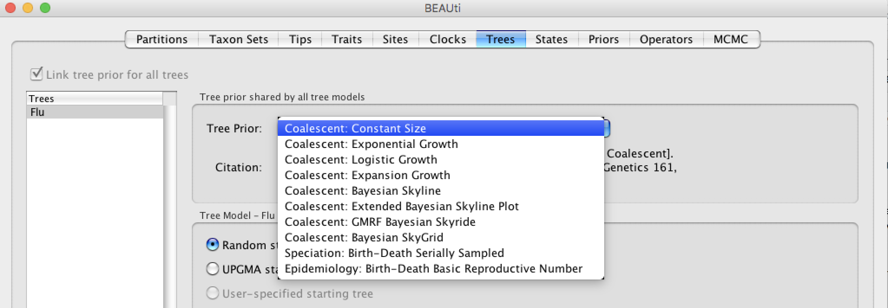

### Choose priors for other parameters
Click the  **Priors** tab in order to set up other priors. The prior column contains clickable button that allow specifying prior for each parameters. In our analysis we have 10 priors with a short description about each parameter. We are not going to change them except for the *ucld.mean*.

*ucld.mean* is the mean of the log-normal distrbution, our prior on the substitution rate. This prior requires our attention since it is not set up. It is important to choose a good/reasonable prior for this one. Influenza viruses have been widely studied and for this gene it is generally recognized that the rate is in the order of magnitude of 10-3 substitutions/site/year. Instead of using an uninformative uniform prior [0,infinity) we can use this information and choose an exponential prior with mean = 3x10-3, which corresponds to previous estimates. Click on the button (it can be labeled **? Not yet specified** if it there is the prior is not specified) next to ucld.mean and select the options as shown in the figure below:

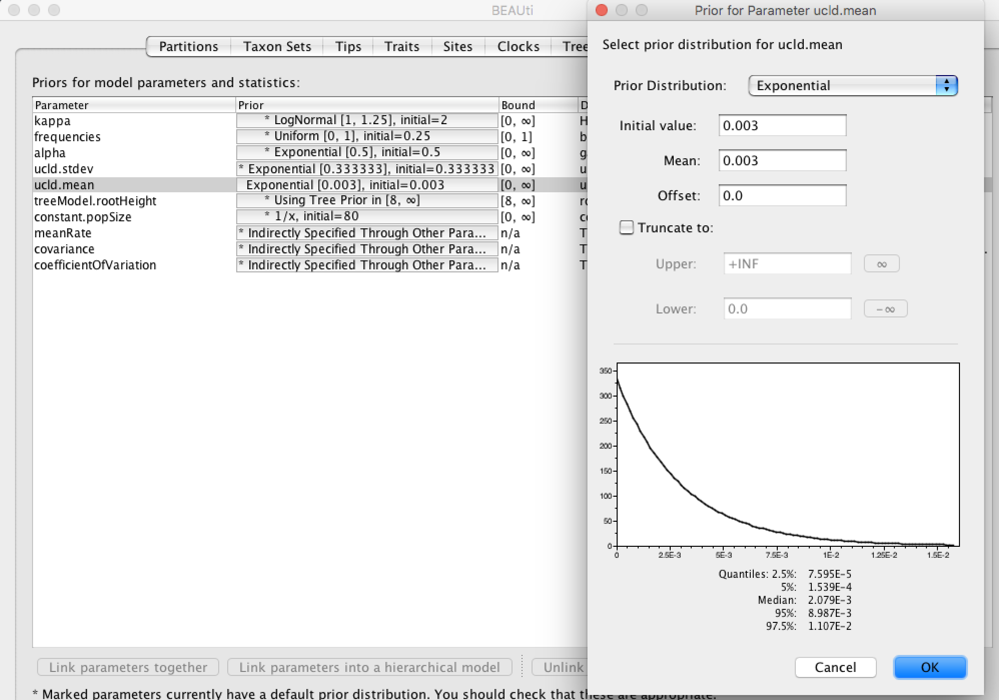

### Setting up the MCMC
The Markov chain Monte Carlo (MCMC) is the algorithm that is going to approximate the posterior distribution of our parameters. The default length of the chain is 107 but since our model is quite simple it can be reduced to 2x106. Finally change the **Log parameters every** to 2000 as shown in the figure below. It is important to note that due to stochasticity the MCMC can require more time to reach stationarity and will give different results every time.

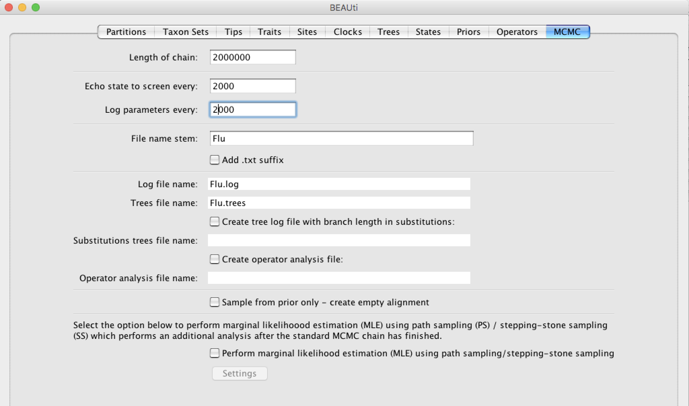

### Generate BEAST File
Once everything is set up correctly click on the **Generate BEAST File** located in the bottom right corner. Another window is going to pop up giving you the opportunity to check your priors, click on **continue** to save your file somewhere like your `Desktop`. By default the file will be named `Flu.xml` and that's fine.

That's it for BEAUTi! Now it is time to run BEAST on the newly generated file.

## BEAST

Run **BEAST**:
* Linux: Open the command line and type `beast`. If the program is not in the path type the full path to the program (e.g. `/home/user/BEAST/bin/beast` where `BEAST` is the BEAST distribution folder).
* Mac: Double click the `BEAST.app` in the `Applications` folder.
* Windows: Double click the `BEAST.exe`.

Click on **Choose File...** and select your `Flu.xml` file. BEAGLE should be unchecked and the number of threads should be set to 0 as seen on the figure bellow:

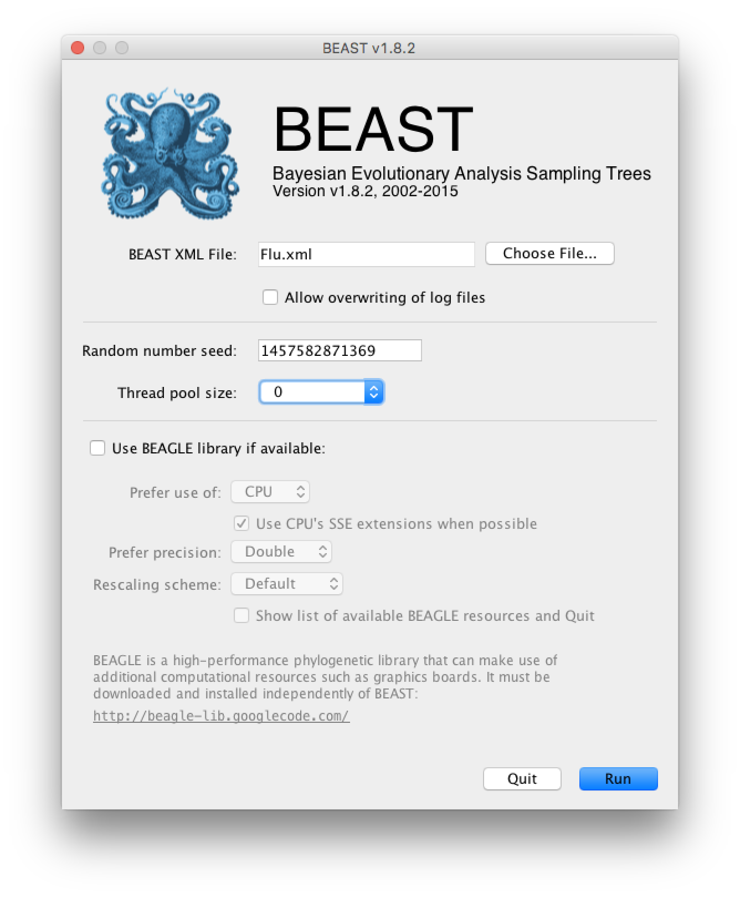

Simply press **Run** to run the program.

Another way to run BEAST without the graphical interface. If the `Flu.xml` file is located on your `Desktop` type:

    cd ~/Desktop
    beast Flu.xml
    

BEAST will take about 5 minutes to finish and will create two files:

* `Flu.log`: this file contains parameters that were sampled by the MCMC.
* `Flu.trees`: this file contains trees that were sampled by the MCMC

## Tracer

Run **Tracer**:
* Linux: Open the command line and type `tracer`. If the program is not in the path type the full path to the program (e.g. `/home/user/Tracer/bin/tracer` where `Tracer` is the Tracer distribution folder).
* Mac: Double click the `Tracer.app` in the `Applications` folder.
* Windows: Double click the `Tracer.exe`.

Import the `Flu.log` file by clicking the **Import Tracer File** in the **File** menu. You can also use drag-and-drop.

The table on the left shows, among other things, the mean marginal posterior distribution for each parameter. The root height (treeModel.rootHeight) and substitution rate (meanRate) can be of particular interest as they suggest that the most recent common ancestor of these viruses is about 10 years older (in the figure below shows 10.7) than the youngest sequence (2005) hence dating the root node to around 1994-1995. The right panel shows plots and further information about a statistic when a row in the table is selected. In the **Estimates**  tab we can find the 95% credibility interval (HPD: highest Posterior Density). The HPD for the root height is, in my case, [8.2, 13.5] which corresponds to [1991,1997] in calendar years.
Similarly, the substitution rate is about 4.02x10-3 substitutions/site/year with a 95% credibility interval of [2.63x10-3, 5.74x10-3].

Note that the effective sample sizes (ESSs) for some of the logged quantities are small (ESSs less than 100 will be highlighted in red by Tracer). This is not good. A low ESS means that the trace contained a lot of correlated samples and thus may not represent the posterior distribution well. In the bottom right of the window is a frequency plot of the samples which is expected given the low ESSs is extremely rough.

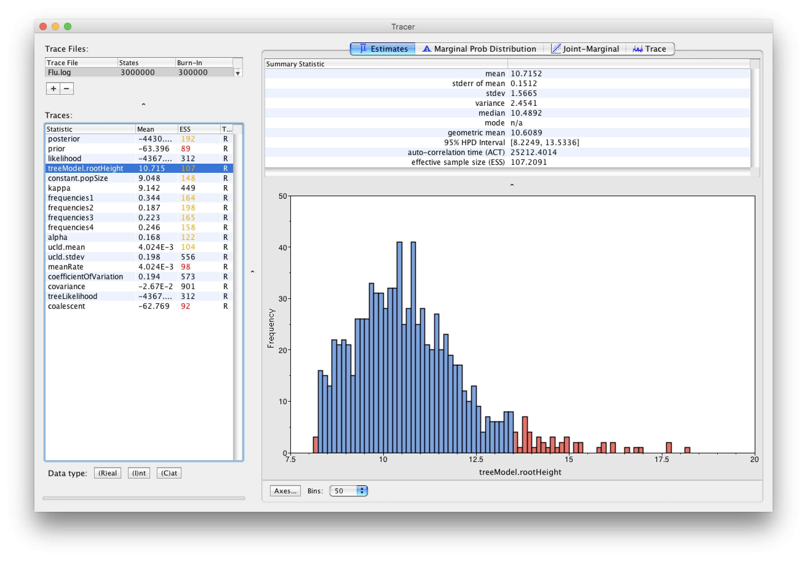

## TreeAnnotator

BEAST also produces a sample of plausible trees along its sample of parameter estimates. These need to be summarized using the program TreeAnnotator. This will take the set of trees and find the maximum clade credibility tree. It will then annotate this summary tree with the mean ages of all the nodes and the HPD ranges. It will also calculate the posterior clade probability for each node and the mean rate of each lineage and the HPD ranges.

Run **TreeAnnotator**:
* Linux: Open the command line and type `treeannotator`. If the program is not in the path type the full path to the program (e.g. `/home/user/BEAST/bin/treeannotator` where `BEAST` is the BEAST distribution folder).
* Mac: Double click the `TreeAnnotator.app` in the `Applications` folder.
* Windows: Double click the `TreeAnnotator.exe`.

We will discard the first 100 trees (There are 1000 trees in total since the chain length was 2x106 and we logged samples every 2000 iteration).

Set it up to look like this:

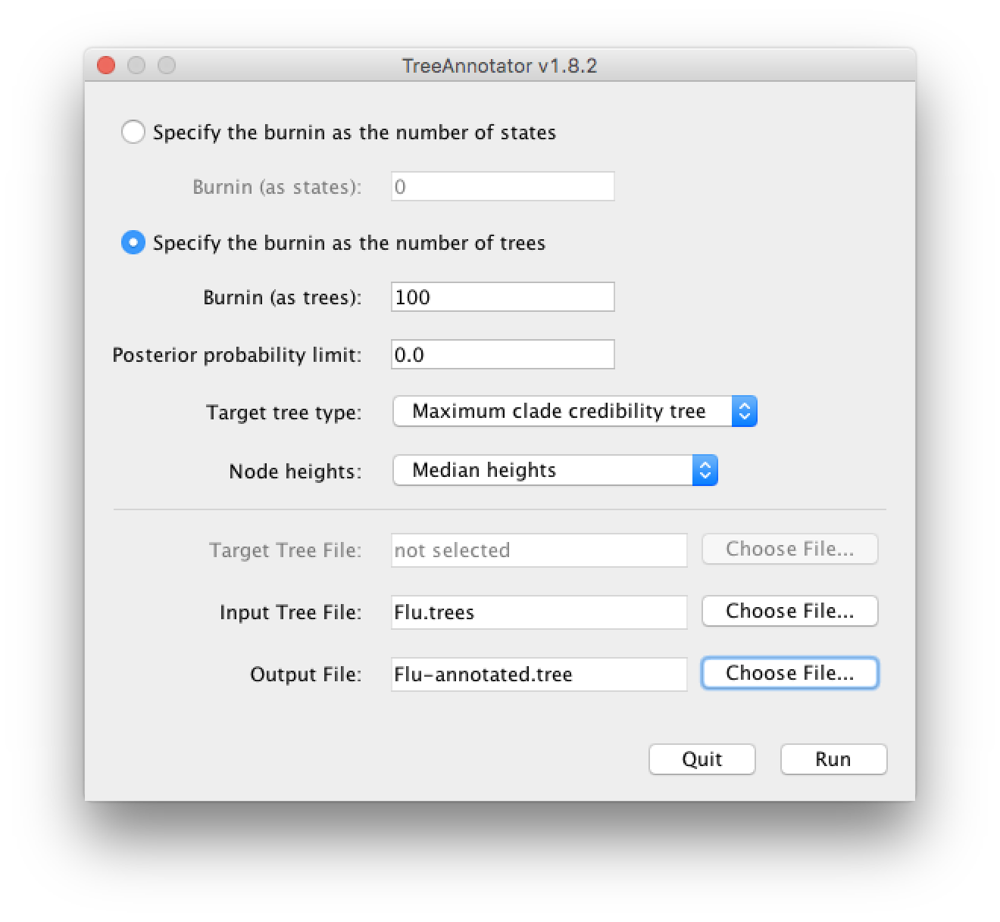

## FigTree
After all these efforts it is now time to look at a tree.

Run **FigTree**:
* Linux: Open the command line and type `figtree`. If the program is not in the path type the full path to the program (e.g. `/home/user/FigTree/bin/figtree` where `FigTree` is the BEAST distribution folder).
* Mac: Double click the `FigTree.app` in the `Applications` folder.
* Windows: Double click the `FigTree.exe`.

Open the `Flu-annotated.tree`. By default FigTree does not show much information and you will have to play with the different options to get more information out of it.

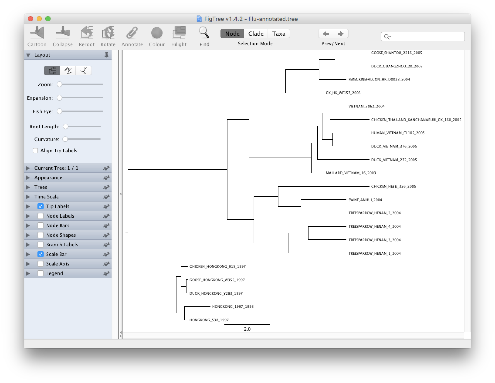

Try to do the following to improve your tree:

* Select **Node Bars** on the left hand side and click on the triangle to show/hide options. Choose **height_95%_HPD**. This will show you graphically the credibility interval calculated by TreeAnnotator.
* Select **Branch Labels** on the left hand side if you want to display information above a branch. Click on the triangle to show/hide options. Choose **rate** if you want to see the mean rate, **rate_95%_HPD** for the credibility interval. Other things can be displayed and the name is usually self explanatory. **Node Labels** is very similar to **Branch Labels** but the information is going to be displayed on the right of the node.
* Select **Scale axis** to show a grid and a scale bar in unit of time. Show more option by clicking on the triangle and select **Reverse axis**. In order to have the right scale go to **Time Scale** and type in 2005 in **Offset by** and change 1.0 to -1.0 for **Scale factor**

There are many another options including coloring branches/taxa, ordering branches automatically or manually, different tree layouts, collapsing clades... Explore!

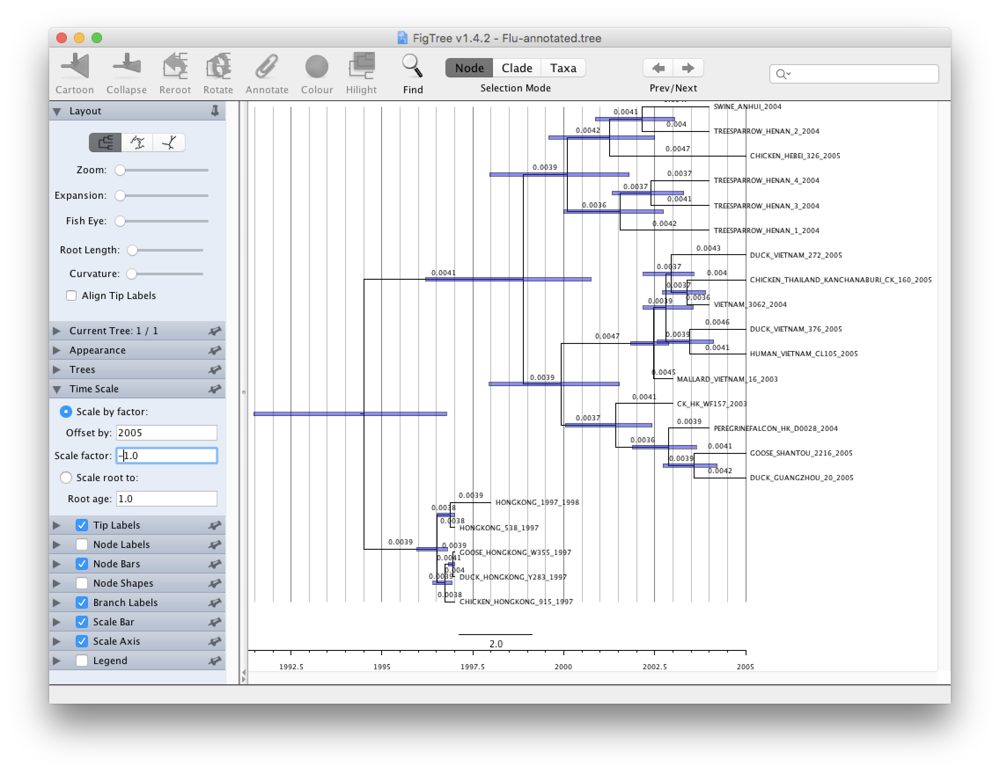

## Conclusion and Resources

This practical only scratches the surface of the analyses that are possible to undertake using BEAST. It has hopefully provided a relatively gentle introduction to the fundamental steps that will be common to all BEAST analyses and provide a basis for more challenging investigations. BEAST is an ongoing development project with new models and techniques being added on a regular basis. The BEAST website provides details of the mailing list that is used to announce new features and to discuss the use of the package. The website also contains a list of tutorials and recipes to answer particular evolutionary questions using BEAST as well as a description of the XML input format, common questions and error messages.

* The BEAST website: [http://beast.bio.ed.ac.uk/](http://beast.bio.ed.ac.uk/)
* Tutorials: [http://beast.bio.ed.ac.uk/Tutorials/](http://beast.bio.ed.ac.uk/Tutorials/)
* Frequently asked questions: [http://beast.bio.ed.ac.uk/FAQ/](http://beast.bio.ed.ac.uk/FAQ/)

## References

* Drummond AJ, Ho SYW, Phillips MJ & Rambaut A (2006) Relaxed Phylogenetics and Dating with Confidence. PLoS Biology 4, e88.
* Drummond AJ, Suchard MA, Xie D & Rambaut A (2012) Bayesian phylogenetics with BEAUti and the BEAST 1.7. Molecular Biology And Evolution, 29: 1969-1973.